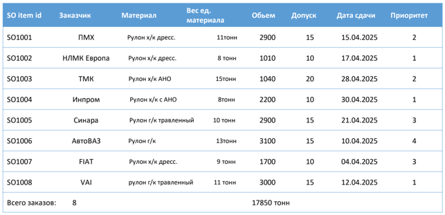
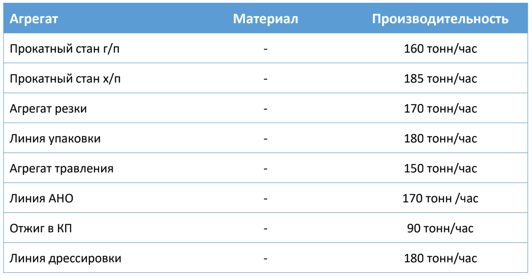
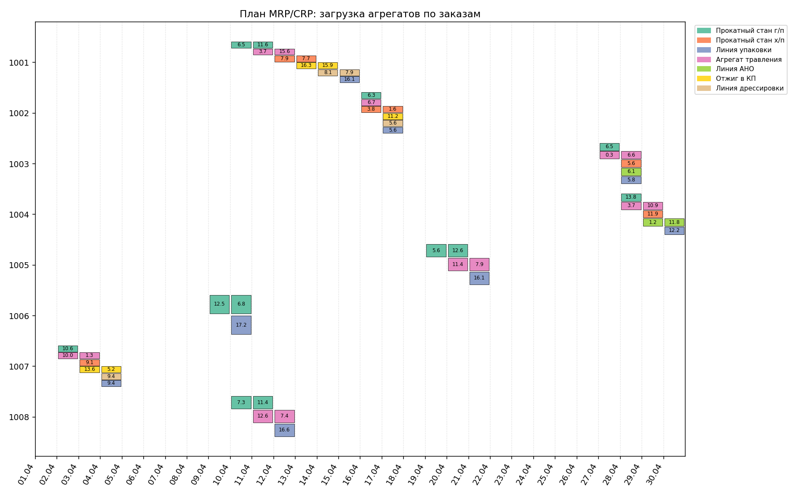
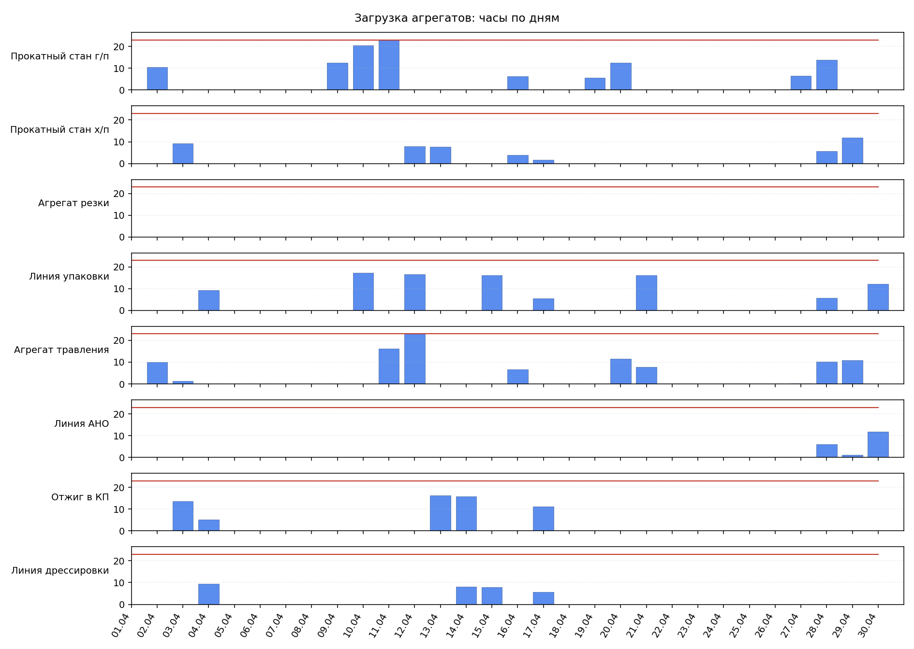

# SCM-project

Проект рассчитывает производственный план MRP/CRP обратным ходом для портфеля
сбытовых заказов. Приложение поднимается в Docker, читает исходные данные из
PostgreSQL, строит календарный план по агрегатам, сохраняет результат в таблицу
`mrp_plan` и выгружает CSV-отчеты и графики в `data/output`.

## Исходные данные

**Вариант 18.**

Сбытовые заказы:



Производительность агрегатов:



В базе используются следующие основные таблицы:

- `customers` - заказчики;
- `products` - справочник продуктов;
- `resources` - производственные агрегаты;
- `sales_orders` - сбытовые заказы;
- `standard_operations` - маршруты обработки продуктов;
- `calendar` - доступная мощность агрегатов по дням;
- `mrp_plan` - рассчитанный производственный план.

Схема создается из `init-db/01-schema.sql`, тестовые данные загружаются из
`init-db/02-seed-data.sql`.

## Алгоритм расчета

Расчет выполняется обратным ходом: от даты отгрузки заказа к более ранним
производственным операциям.

1. Приложение загружает активные заказы из `sales_orders`, маршруты из
   `standard_operations`, календарь мощностей из `calendar` и справочники
   продуктов и агрегатов.
2. Для каждого заказа определяется количество единиц продукции:
   `floor(target_weight / unit_weight)`.
3. Рассчитывается вес сдачи заказа. Если вес не попадает в допустимое отклонение
   `target_weight +/- tolerance`, заказ пропускается.
4. Для продукта берется маршрут операций, отсортированный по `operation_id`.
5. По маршруту считается требуемый вес, количество единиц и часы работы:
   `hours = tons / performance`.
6. Операции размещаются в календаре с конца маршрута к началу. Для каждой даты
   учитываются два ограничения:
   - доступные часы конкретного агрегата из `calendar`;
   - не более 24 часов работ по одному заказу в сутки.
7. Если мощности текущего дня не хватает, остаток операции переносится на
   предыдущий день.
8. Итоговые строки сохраняются в `mrp_plan`, затем формируются CSV-сводки и
   графики.

## Структура проекта

```text
.
├── assets/
│   ├── data1.png
│   └── data2.png
├── data/output/
├── init-db/
│   ├── 01-schema.sql
│   └── 02-seed-data.sql
├── src/
│   ├── config.py
│   ├── database.py
│   ├── export.py
│   ├── main.py
│   ├── models.py
│   └── planner.py
├── Dockerfile
├── docker-compose.yml
├── pyproject.toml
└── README.md
```

Назначение модулей:

- `src/config.py` - настройки приложения и подключения к БД;
- `src/database.py` - загрузка данных и запись результата через SQLAlchemy;
- `src/planner.py` - алгоритм MRP/CRP;
- `src/export.py` - экспорт CSV и PNG;
- `src/main.py` - точка входа приложения.

## Запуск

Скопируйте пример переменных окружения:

```bash
cp .env.example .env
```

При необходимости отредактируйте `.env`. Значения по умолчанию рассчитаны на
запуск через `docker compose`.

Соберите и запустите контейнеры:

```bash
docker compose build
docker compose up -d
```

Приложение выполнит расчет после старта контейнера `app`. PostgreSQL будет
доступен на `127.0.0.1:5432`.

Если база уже была создана раньше и нужно заново применить SQL-скрипты
инициализации, остановите контейнеры и удалите локальные данные PostgreSQL:

```bash
docker compose down
rm -rf data/postgres
docker compose up -d
```

## Результаты

После расчета результаты появляются в `data/output`.

CSV-отчеты:

- [plan_hours.csv](data/output/plan_hours.csv) - загрузка в часах;
- [plan_tons.csv](data/output/plan_tons.csv) - объем в тоннах;
- [plan_units.csv](data/output/plan_units.csv) - количество единиц продукции.

График плана по заказам и агрегатам:



График загрузки агрегатов по дням:



Результат также записывается в таблицу `mrp_plan` в PostgreSQL.
